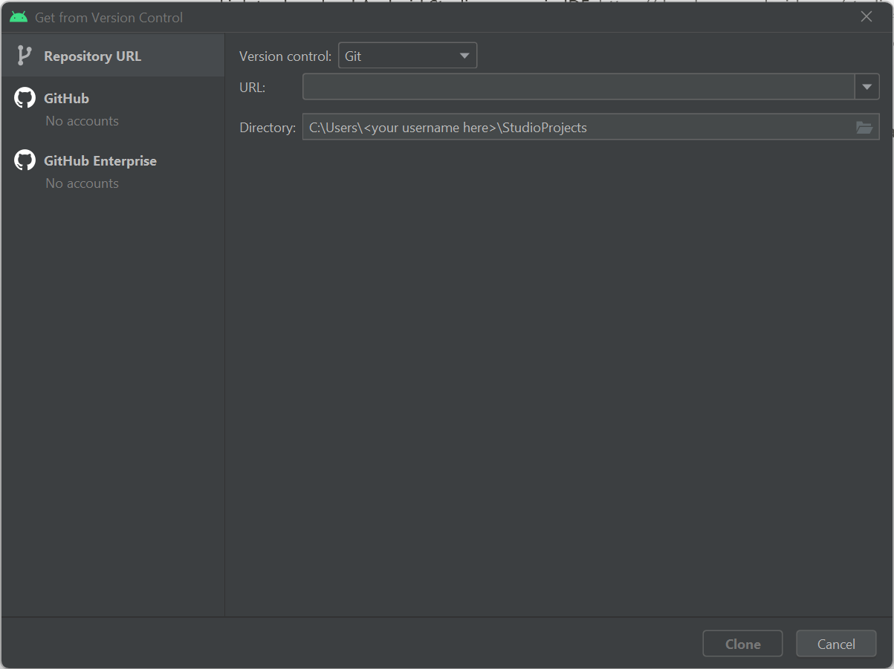
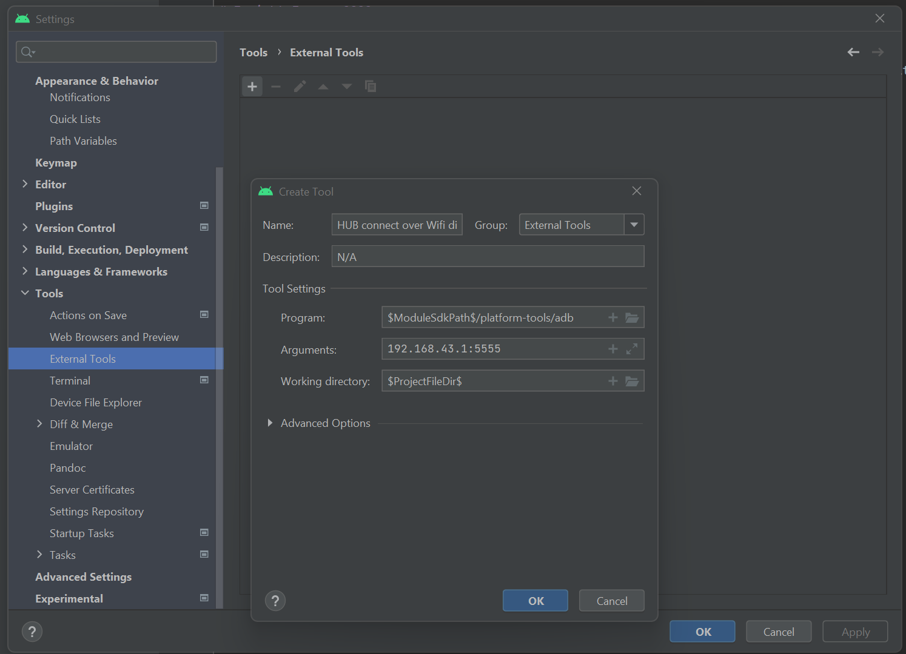

# Onboarding

<aside>
😀 Welcome to the FTC 5206 onboarding page! This page contains instructions to install and understand the tools we use to work as a team. We have provided separate sets of instructions for the hardware and software teams, so please click on the relevant link below to get started.

</aside>

# Hardware

## Fusion360 Setup and Execution

1)  Fusion360 is the main software tool utilized to plan frameworks important later on in the robot fabrication process. For this reason, adequate understanding of Fusion 360 and its operation is vital.

2) Luckily, Fusion360 is free to use for educational purposes. This means that you **MUST UTILIZE** your Stanford OHS email when signing up.

a) To sign up a fusion account go to: ([https://www.autodesk.com/education/edu-software/overview?sorting=featured&filters=individual](https://www.autodesk.com/education/edu-software/overview?sorting=featured&filters=individual))

b) In the bar at the top, please click “Get Started”.

c) It should then ask you to sign in or create a new account. If you don’t have an existing account: please create one. If you have an existing account, sign in. 

1. To create an account: Fill in all of the required information to create an account. (in the rare case that you are under the age of 13, contact the hardware lead.) 
2. When inputting your email, be sure to **USE YOUR OHS EMAIL** - the one that ends in ohs.stanford.edu. 
3. And then click “Create Account”

d) Once you have finished creating an account, you will have to type in your school name (Stanford University High School) and some other questions. Once done, click the link again, and press “get product” and then “access”. 

e) Now, the application begin downloading on your computer. Double click on the file to start the installation process. The installer should pop up and double click again, so open the application. It should start setting up! You have successfully downloaded and installed Fusion360. 

3) Once you have the free education account and have downloaded and installed Fusion360, please let Ryan, Arhan, or Tanisha know and we can invite you to the Team Fusion360 Workspace where you will have access to past robot CAD designs and current designs. (you will get an email to join the workspace so make sure to check your Spam folder incase it got sent there!)

4) Now that you have joined the workspace, start by creating a new folder and title it “[insert your name here] CAD Training”. This is now your folder to practice using Fusion and working with the different parts. To start out with please go through the different tutorials at this link:

[https://ryannealyworms.wixsite.com/5206cad](https://ryannealyworms.wixsite.com/5206cad)

By following the tutorials, you will gain some valuable experience with the various tools that Fusion has to offer.  This provides an important foundation when working on the robot’s mechanisms.

## Hardware Skills

Onsite, a lot of the tools that we will be using will be hand tools. Occasionally, power tools will be used for the robot but in these scenarios it is vital that you are accompanied by Ryan, Tanisha, or Arhan in the interest of safety.

Though the use of hand tools can seem quite straightforward, please view this valuable resource on safety and common practical use:

[https://www.youtube.com/watch?v=r9YYFwEVIgU](https://www.youtube.com/watch?v=r9YYFwEVIgU)

Beyond the basics, a lot of these skills will become more familiar through direct application.

## 3D Printing

For our hardware designs, we first meet and sketch out designs and then translate our designs to a 3D model on CAD. We then use this CAD Model and 3D print them. 3D printing gives us much more customizability than off the shelf parts.

When thinking about utilizing the 3D Printer it is important to consider two things:

1) Can another normal part accomplish the intended goal?

2) If so, communicate your ideas to Ryan, Arhan or Tanisha and the part can be 3D Printed.

- For this process make sure that you have a PrusaSlicer file with exact measurements while also keeping in mind factors like size  and material/time used.

(FURTHER NOTES ON THIS MATTER WILL BE ADDED AFTER CONFERRING WITH THOMAS AND DIRECT USE OF THE 3D PRINTER).

# Software

Welcome to the software team! We’re glad to have you here. This tutorial will help you download, install, and set up the software tools needed to the help contribute to the FTC 5206 codebase. One of our core values is inclusivity, so we want to make sure that anyone regardless of experience feels ready to participate. Therefore, we’ve split this guide into two sections. 

The first section describes how to install graphical versions of all the apps needed. Most new members will find this process easiest to follow and most convenient because it avoids the use of a terminal, which is a way to issue text-based commands to control a computer. Although the terminal is a widely useful tool that is used by programmers around the world, it is not necessary to use to participate in our team. 

If you are already comfortable with the terminal, the second section describes how to install all necessary programs, centering around terminal-based applications when possible. Make sure to follow the instructions for your specific operating system, as the methods used might change depending on that. 

During the software onboarding process, we will help you install two tools. The first is an Integrated Development Environment (IDE), which is a program that is used to write, debug, and deploy code. The IDE we’ll be using is called Android Studio, although you are free to choose another IDE if you’re already comfortable using one. The second tool is a program called Git, which is a Version Control Software (VCS) that we use to keep track of each member’s changes to the code. 

Throughout the instructions, we’ll provide several links to outside articles explaining how each of the tools we install work. We highly recommend that you carefully read each article, as the concepts explained there are fundamental to the operation of our team. If you have any questions at all during the onboarding process, don’t hesitate to contact Rohan Satapathy, Ashwin Naren, Ethan Yun, or Ryan Lin on Slack. 

## GitHub

Sign-up link:

[https://github.com/signup](https://github.com/signup?ref_cta=Sign+up&ref_loc=header+logged+out&ref_page=%2F&source=header-home)

GitHub is an internet hosting service that allows programmers to store, manage, track and control their code using Git. Effectively, it lets you store code online in an easier way that allows many people to collaborate. 

Optionally, you can install GitHub Desktop to simplify using git [here](https://desktop.github.com/). Or `brew install --cask github` on macs, or `winget install -e --id GitHub.GitHubDesktop` on windows.

## Installation Instructions (No Terminal)

### Git

To install git visit [https://git-scm.com/downloads](https://git-scm.com/downloads). Alternatively, macOS users may run `brew install git`,  or for Windows, `winget install git` in their terminal. Linux users may install git with their default package manager.

Git is a Version Control System (VCS) that is used keep everyone’s version of the code up to date. [Here](https://rogerdudler.github.io/git-guide/) is a basic Git tutorial that should help get you started. [https://www.vogella.com/tutorials/Git/article.html](https://www.vogella.com/tutorials/Git/article.html) is a more in-depth tutorial.

### IDE

Link to download Android Studio, our main IDE: [https://developer.android.com/studio/](https://developer.android.com/studio/)

An IDE, or Integrated Development Environment, is an app that lets programmers code on a single interface. Basically, IDEs let you do all your coding in one space with features to streamline the process as much as possible.

We use Android Studio because it is a base Java IDE that comes with all of the necessary additions to deploy code onto the robot.

## Installation Instructions (Terminal)

Please follow the following instructions to install Android Studio and Git using the command line. We’ve provided separate instructions for Windows and Mac users, so make sure to follow the instructions for your specific operating system. Before we begin, make sure to read this warning. 

<aside>
 NEVER copy and paste scripts from the internet into your terminal. Doing so runs the risk of compromising your computer because it is possible for websites to inject malicious code that runs as soon as you paste it in. If you are going to copy and paste a command into your terminal, make sure you understand EXACTLY what the code is doing, and make sure that you have complete trust in the source.

</aside>

With that warning out of the way, let’s get started installing the software needed for our system. 

### Windows

To install the necessary software on Windows, we will first install a package manager called `winget`. A package manager is a tool that automates the download and installation of other pieces of software, and is generally safer and easier to use than `.exe` files because each program is published to a trusted repository. 

Most modern Windows 10/11 systems should come with `winget` already installed. To check whether this is the case, open the Command Prompt by hitting `Win+R` and typing “cmd” at the prompt. Once you’re there, type the following command and hit `Enter`:

```powershell
winget
```

If you see an output with help text, `winget` is ready to go. If you see something else, install `winget` by installing the [App Installer](https://apps.microsoft.com/store/detail/app-installer/9NBLGGH4NNS1?hl=en-us&gl=us) program, then close and reopen Command Prompt and try the above command again. 

Next, issue the following commands using `winget` in the command prompt (hit `Enter` after each line):

```powershell
winget install -e --id Google.AndroidStudio
winget install -e --id Git.Git
```

If you would like to install IntelliJ IDEA, Visual Studio Code, or another IDE instead of Android Studio, use [this website](https://winget.run/) to search for the relevant command. 

Once you are done, setup Android Studio. 

### Mac

Open the app called “terminal”

Next type (or paste) the following into the terminal:

```bash
which brew
```

If it says brew is not installed, you need to install brew. To install brew type:

```bash
/bin/bash -c "$(curl -fsSL https://raw.githubusercontent.com/Homebrew/install/HEAD/install.sh)"
```

Next paste this text:

```bash
brew install git
brew install --cask android-studio
```

Next setup Android Studio.

## Setting up Android Studio

- Open Android Studio
- Click “Do not import settings”
- Use standard setup
- Wait for the download to finish

## Project Setup

1. Open Android Studio
2. Click “Get from VCS”
3. Use [https://github.com/The-Knights-of-Ni/PowerPlay/](https://github.com/The-Knights-of-Ni/PowerPlay/) for the url.
    
    
    
4. Click “Clone”
5. The repo will open and load the Read Me.
6. Go to your Android Studio settings (File>Settings), go to Tools>External Tools click the plus button, then fill it out with this:
Name: HUB connect over Wifi Direct
Group: External tools
Description: N/A
Program: $ModuleSdkPath$/platform-tools/adb
Arguments: connect 192.168.43.1:5555
Working Directory: $ProjectFileDir$
Then click done.



## Working with the Code

Make the appropriate changes to the code and then click the green check mark on the top right hand side of your screen to commit the changes


Next write a message accurately summarizing the changes you have made to the code so that others can check at a glance what you did.

Finally click “Commit and Push” and use the default options.