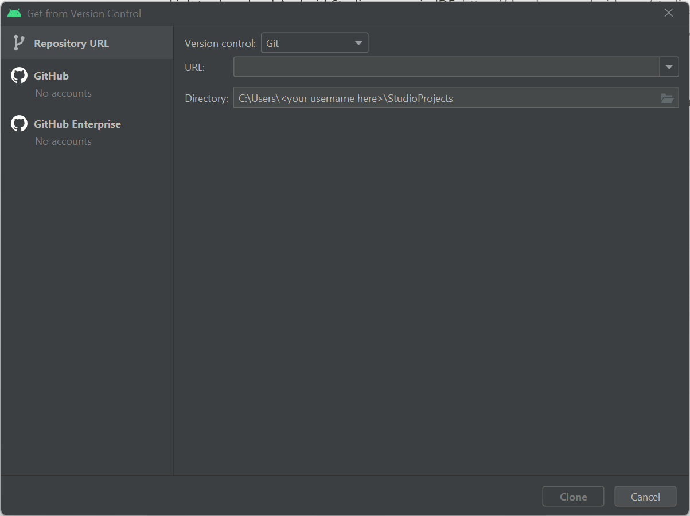
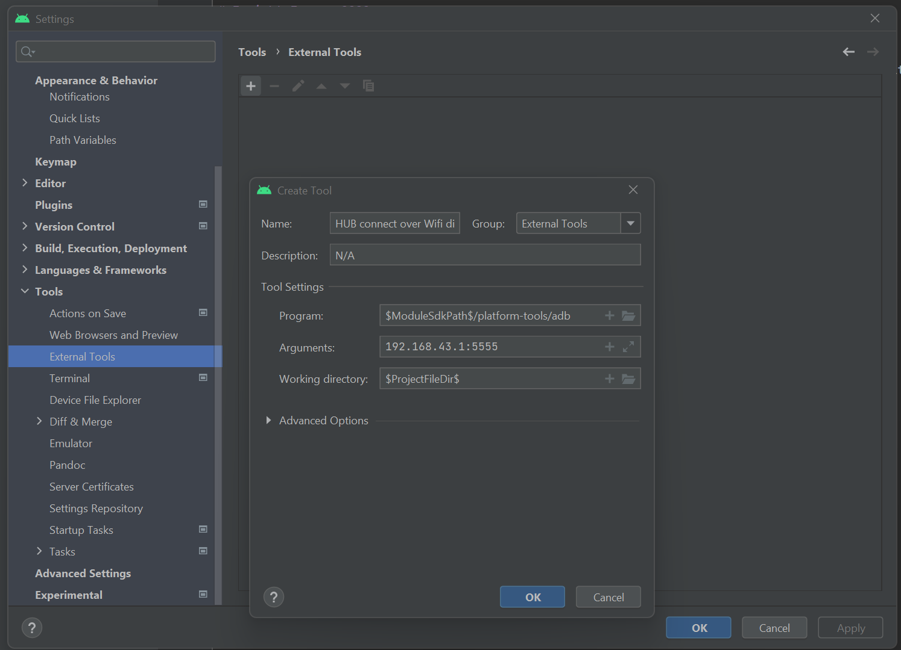
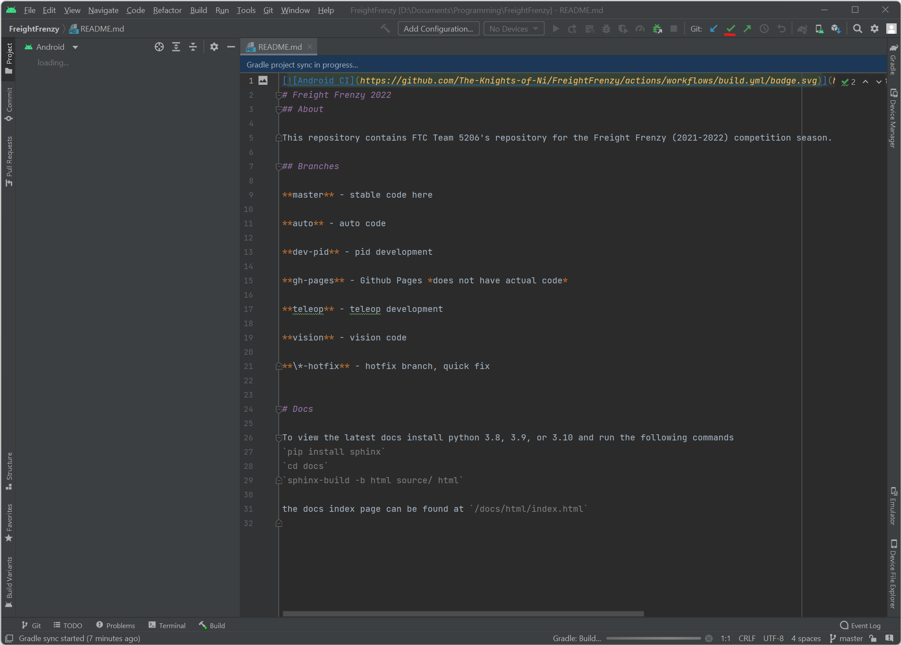

Software Onboarding
=========================
Welcome to the software team! We’re glad to have you here.

This tutorial will help you download, install, and set up the software tools needed to the help contribute to the FTC 5206 codebase.
One of our core values is inclusivity, so we want to make sure that anyone regardless of experience feels ready to participate.
Therefore, we’ve split this guide into two sections.

The first section describes how to install graphical versions of all the apps needed.
Most new members will find this process easiest to follow and most convenient because it avoids the use of a terminal, which is a way to issue text-based commands to control a computer. Although the terminal is a widely useful tool that is used by programmers around the world, it is not necessary to use to participate in our team.

If you are already comfortable with the terminal, the second section describes how to install all necessary programs, centering around terminal-based applications when possible.
Make sure to follow the instructions for your specific operating system, as the methods used might change depending on that.

During the software onboarding process, we will help you install two tools.
The first is an Integrated Development Environment (IDE), which is a program that is used to write, debug, and deploy code. The IDE we’ll be using is called Android Studio, although you are free to choose another IDE if you’re already comfortable using one. The second tool is a program called Git, which is a Version Control Software (VCS) that we use to keep track of each member’s changes to the code.
Throughout the instructions, we’ll provide several links to outside articles explaining how each of the tools we install work. We highly recommend that you carefully read each article, as the concepts explained there are fundamental to the operation of our team.

If you have any questions at all during the onboarding process, don’t hesitate to contact Rohan Satapathy, Ashwin Naren, Ethan Yun, or Ryan Lin on Slack.

GitHub
___________

Sign-up link:

https://github.com/signup

GitHub is an internet hosting service that allows programmers to store, manage, track and control their code using Git.
Effectively, it lets you store code online in an easier way that allows many people to collaborate.

Optionally, you can install GitHub Desktop to simplify using git `from the website <https://desktop.github.com/>`_.
Or ``brew install --cask github`` on macs, or ``winget install -e --id GitHub.GitHubDesktop`` on windows.

Installation Instructions (No Terminal)
_________________________________________

Git
^^^^

To install git visit https://git-scm.com/downloads.

Git is a Version Control System (VCS) that is used keep everyone’s version of the code up to date.
`Here <https://rogerdudler.github.io/git-guide/>`_ is a basic Git tutorial that should help get you started.
https://www.vogella.com/tutorials/Git/article.html is a more in-depth tutorial.

IDE
^^^^^

Link to download Android Studio, our main IDE: https://developer.android.com/studio/

An IDE, or Integrated Development Environment, is an app that lets programmers code on a single interface.
Basically, IDEs let you do all your coding in one space with features to streamline the process as much as possible.
We use Android Studio because it is a base Java IDE that comes with all of the necessary additions to deploy code onto the robot.

Installation Instructions (Terminal)
_______________________________________

Please follow the following instructions to install Android Studio and Git using the command line.
We’ve provided separate instructions for Windows and Mac users, so make sure to follow the instructions for your specific operating system.
Before we begin, make sure to read this warning.

.. danger::

    NEVER copy and paste scripts from the internet into your terminal. Doing so runs the risk of compromising your computer
    because it is possible for websites to inject malicious code that runs as soon as you paste it in.
    If you are going to copy and paste a command into your terminal, make sure you understand EXACTLY what the code is doing,
    and make sure that you have complete trust in the source.

With that warning out of the way, let’s get started installing the software needed for our system.

Windows
^^^^^^^^^

To install the necessary software on Windows, we will first install a package manager called ``winget``.
A package manager is a tool that automates the download and installation of other pieces of software,
and is generally safer and easier to use than ``.exe`` files because each program is published to a trusted repository.
Most modern Windows 10/11 systems should come with ``winget`` already installed. To check whether this is the case,
open the Command Prompt by hitting ``Win+R`` and typing ``cmd`` at the prompt. Once you’re there, type the following command and hit ``Enter``:

.. code::

    winget

If you see an output with help text, ``winget`` is ready to go. If you see something else, install ``winget`` by installing the
`App Installer <https://apps.microsoft.com/store/detail/app-installer/9NBLGGH4NNS1?hl=en-us&gl=us>`_ program, then close and reopen Command Prompt and try the above command again.

Next, issue the following commands using ``winget`` in the command prompt (hit ``Enter`` after each line):

.. code::

    winget install -e --id Google.AndroidStudio
    winget install -e --id Git.Git

If you would like to install IntelliJ IDEA, Visual Studio Code, or another IDE instead of Android Studio, use `this website <https://winget.run/>`_ to search for the relevant command, or download them from the official website directly.

Once you are done, setup Android Studio.

Mac
^^^^^^^^^

Open the app called “terminal”

Next type (or paste) the following into the terminal:

.. code:: shell

    which brew

If it says brew is not installed, you need to install brew. To install brew type:

.. code:: shell

    /bin/bash -c "$(curl -fsSL https://raw.githubusercontent.com/Homebrew/install/HEAD/install.sh)"

Next paste this text:

.. code:: shell

    brew install git
    brew install --cask android-studio

Next setup Android Studio.

Setting up Android Studio
___________________________

- Open Android Studio
- Click “Do not import settings”
- Use standard setup
- Wait for the download to finish

Project Setup
___________________

1. Open Android Studio
2. Click “Get from VCS”
3. Use https://github.com/The-Knights-of-Ni/PowerPlay/ for the url.

4. Click “Clone”
5. The repo will open and load the Read Me.
6. Go to your Android Studio settings (File>Settings), go to Tools>External Tools click the plus button, then fill it out with this:

.. code:: none

    Name: HUB connect over Wifi Direct
    Group: External tools
    Description: N/A
    Program: $ModuleSdkPath$/platform-tools/adb
    Arguments: connect 192.168.43.1:5555
    Working Directory: $ProjectFileDir$
    Then click done.

Working with the Code
___________________________

Make the appropriate changes to the code and then click the green check mark on the top right hand side of your screen to commit the changes

Next write a message accurately summarizing the changes you have made to the code so that others can check at a glance what you did.

Finally click “Commit and Push” and use the default options.
