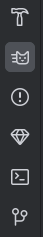
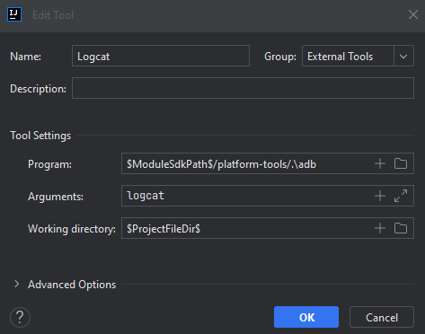

Debugging
=================

ADB
------------

To load code onto the robot, we use a tool called Android Debug Bridge, or ADB. This tool, usable both directly from the commandline
and from Android Studio/IntelliJ allows us to streamline the process of loading code onto the robot.

Logcat
------------

Logcat is a logging tool provided to us by ADB that allows us to catch log statements from Android devices, including our robot.
It grabs logs from the whole system and allows us to stream logs directly from the robot to our computer with color and other formatting.
To open Logcat, go to the bottom left of your Android Studio and select the cat icon as shown.

.. note:: If you are on IntelliJ IDEA and you cannot open Logcat, you can configure it as an external tool.

Telemetry
------------

Telemetry is an FTC internal function that allows us to take logs and output them on the Driver Station. This is useful for more basic, brief logs,
basically where Logcat is overkill. Telemetry is, due to it being on the Driver Station, most useful for giving information to the driver.

Web Logs
------------

This year, a web server was added to the robot, accessible by connecting to the robot's WiFi network and typing address ``192.168.43.1:7070`` in
the address bar of Mozilla Firefox or any comparable browser. This website is just a JSON dump that you can copypaste into a text editor and look at
that way.
